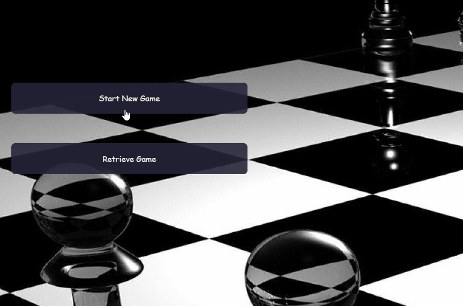

# CHESSMATE 
---

## Description
  Chessmate is a light-weight chess game app that implements a basic chess functionality such as ability to save the game and check player's turn

---

## Installation
  To get the game running please run the following terminal commands

  1. bundle install
  2. rails db:migrate
  3. rails db:seed